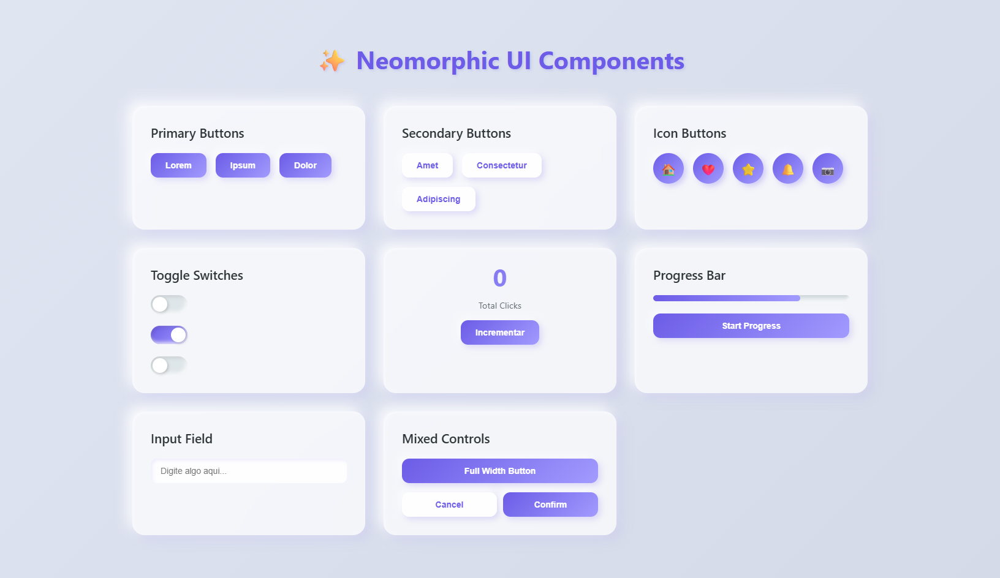

# neomorphic-ui-components
# Neomorphic UI Components

Modern neomorphic UI components with glassmorphism effects - Interactive buttons, cards and widgets in purple theme



## Sobre o Projeto

Este projeto é uma coleção de componentes de interface moderna utilizando o design neomórfico (neumorphism) combinado com efeitos de glassmorphism. Perfeito para criar interfaces elegantes e interativas com um visual contemporâneo.

## Funcionalidades

- **Botões Primários e Secundários** - Com efeitos hover suaves
- **Botões com Ícones** - Circulares com animações
- **Toggle Switches** - Interruptores animados
- **Contador de Cliques** - Estatísticas dinâmicas em tempo real
- **Barra de Progresso** - Animada e responsiva
-  **Campo de Input** - Com feedback visual ao usuário
- **Alertas Animados** - Notificações elegantes
- **Design Responsivo** - Adapta-se a diferentes tamanhos de tela

## Tecnologias Utilizadas

- **HTML5** - Estrutura semântica
- **CSS3** - Estilização com gradientes e sombras neomórficas
- **JavaScript** - Interatividade e animações

## Características do Design

- Efeito **Glassmorphism** nos cards
- Sombras **Neomórficas** (côncavas e convexas)
- Gradientes em tons de **roxo/lilás**
- Animações **suaves** e transições fluidas
- Efeitos **hover** interativos

## Como Usar

1. Clone este repositório:
```bash
git clone https://github.com/erikalaiane/neomorphic-ui-components.git
```

2. Entre na pasta do projeto:
```bash
cd neomorphic-ui-components
```

3. Abra o arquivo `index.html` no seu navegador ou use o Live Server do VSCode

## Estrutura de Arquivos

```
neomorphic-ui-components/
│
├── index.html          # Estrutura HTML principal
├── style.css           # Estilos neomórficos e glassmorphism
├── script.js           # Funcionalidades interativas
├── README.md           # Documentação do projeto
└── image/
    └── site.png        # Screenshot do projeto
```

## Componentes Disponíveis

### Botões
- Primary buttons com gradiente
- Secondary buttons com fundo claro
- Icon buttons circulares

### Controles
- Toggle switches com animação
- Input fields estilizados
- Progress bars animadas

### Cards
- Cards com efeito glassmorphism
- Hover effects suaves
- Sombras neomórficas

## Melhorias Futuras

- [ ] Adicionar modo escuro (dark mode)
- [ ] Criar mais variações de componentes
- [ ] Adicionar animações de loading
- [ ] Implementar tooltips
- [ ] Criar sistema de notificações
- [ ] Adicionar modais neomórficos

## Como Contribuir

Contribuições são sempre bem-vindas! Sinta-se à vontade para:

1. Fazer um fork do projeto
2. Criar uma branch para sua feature (`git checkout -b feature/NovaFuncionalidade`)
3. Commit suas mudanças (`git commit -m 'feat: adiciona nova funcionalidade'`)
4. Push para a branch (`git push origin feature/NovaFuncionalidade`)
5. Abrir um Pull Request

##  Autora

Feito com 💜 por [Érika Laiane](https://github.com/erikalaiane)

---
